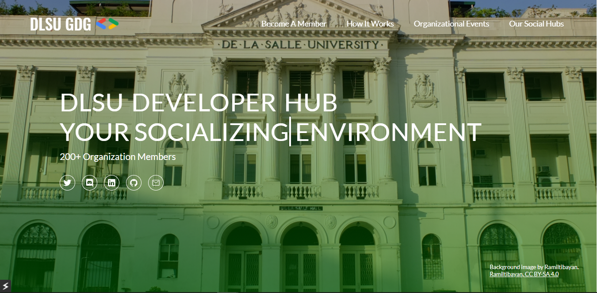

# DSC-react
The website can be visited [through this link](https://programmernammer.github.io/DSC-react/). This repository represents a take on the DLSU DSC Organization website for recuiting onlooking members - the site represents the Organization's 

## Run in your Local Computer
1. Download and extract the Github Repository to your local directory
2. Navigate to the directory
3. Install all the dependencies of the Project through `npm install`
4. Deploy the Project to your Local Browser through `npm start`

## Want to have your own take on the design?
1. Fork the Repository
2. Create a new branch.
On the Git Bash `git checkout -b branch-name`
3. Make the appropriate changes
4. Commit your changes

## Features To-Be-Implemented
* Colored Word Carousel
* Content
  * About Us
    * Vision
    * Mission
  * Technology Stacks Used
  * Members
  * Member Annotations
  * Projects done & Events hosted
* Plug Social Media Links

## Bugs
If a bug is encountered, please do not hesitate to [open a new issue here](https://github.com/ProgrammerNammer/DSC-react/issues/new). Include what the circumstances were and any other information needed in replicating your issue. Remember, a well-documented Bug Report is as good as a solved one! 

## Feature Request
Have an interesting/not idea on mind? Do not hesitate to suggest it here.
